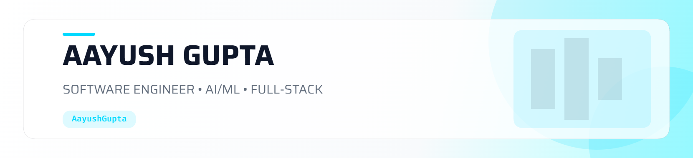

<!-- ========================================================= -->
<!--                       HERO BANNER                         -->
<!-- ========================================================= -->

<picture>
  <source
    media="(prefers-color-scheme: dark)"
    srcset="header-dark.png"
  />
  <source
    media="(prefers-color-scheme: light)"
    srcset="header-light.png"
  />
  
</picture>

 

<!-- ========================================================= -->
<!--                     TYPING ANIMATION                      -->
<!-- ========================================================= -->

  

  
  
  

 

<!-- ========================================================= -->
<!--                         ABOUT ME                          -->
<!-- ========================================================= -->

<h2>👨‍💻 About Me</h2>

I'm a <strong>Computer Science undergraduate at Shiv Nadar University, Noida</strong>
with a <strong>9.30 GPA</strong>, passionate about building software systems and
AI-powered applications.

Currently, I'm an <strong>AI & Software Engineering Intern at Kyndryl</strong>,
where I work on distributed systems, reliability, observability, and
AI-powered developer tooling.

I enjoy working across the stack — from designing backend systems and databases
to building modern interfaces and experimenting with machine learning,
Transformers, RAG, and Agentic AI.

 

<!-- ========================================================= -->
<!--                      QUICK FACTS                         -->
<!-- ========================================================= -->

<table align="center">
<tr>
<td align="center" width="25%">

### 🎓

<strong>Education</strong>

B.Tech CSE

Shiv Nadar University

</td>

<td align="center" width="25%">

### 💼

<strong>Currently</strong>

AI & Software

Engineering Intern

@ Kyndryl

</td>

<td align="center" width="25%">

### 🧠

<strong>Focus</strong>

AI/ML

Full-Stack

Software Engineering

</td>

<td align="center" width="25%">

### 🏆

<strong>Achievement</strong>

Top 15

GoDaddy AI

Buildathon 2026

</td>
</tr>
</table>

 

<!-- ========================================================= -->
<!--                      WHAT I BUILD                         -->
<!-- ========================================================= -->

<h2>⚡ What I Build</h2>

<table>
<tr>

<td width="33%" align="center">

<h3>⚡ Full-Stack</h3>

Modern web applications using
<strong>React, Next.js, Node.js</strong>
and relational / NoSQL databases.

</td>

<td width="33%" align="center">

<h3>🤖 AI / ML</h3>

AI-powered applications using
<strong>PyTorch, Transformers, RAG</strong>
and modern AI workflows.

</td>

<td width="33%" align="center">

<h3>☁️ Systems</h3>

Interested in <strong>distributed systems,
cloud infrastructure, reliability
and backend architecture.</strong>

</td>

</tr>
</table>

 

<!-- ========================================================= -->
<!--                    FEATURED PROJECTS                      -->
<!-- ========================================================= -->

<h2>🚀 Featured Projects</h2>

<table>
<tr>

<td width="50%" valign="top">

<h3>🎥 VidTube-AI</h3>

<strong>AI-powered media processing SaaS</strong>

A full-stack SaaS platform for uploading, managing,
and transforming media using Cloudinary AI capabilities.

<code>Next.js</code>
<code>Node.js</code>
<code>Prisma</code>
<code>NeonDB</code>
<code>Cloudinary</code>
<code>Clerk</code>

• AI-powered media transformation 
• Video compression 
• Hover video previews 
• Automatic image transformations 
• Secure authentication 
• PostgreSQL data management

</td>

<td width="50%" valign="top">

<h3>🏠 BookNow</h3>

<strong>Full-stack property booking platform</strong>

A property listing and booking platform built using
MVC architecture with search, filtering, reviews,
authentication and location visualization.

<code>Node.js</code>
<code>Express.js</code>
<code>MongoDB</code>
<code>EJS</code>
<code>Cloudinary</code>
<code>Mapbox</code>

• Property search & filtering 
• User reviews 
• Complete CRUD operations 
• Passport.js authentication 
• Joi validation 
• Mapbox integration

</td>

</tr>

<tr>

<td width="50%" valign="top">

<h3>🤖 SummarizerAI</h3>

<strong>Transformer-based conversational summarization</strong>

An end-to-end AI application using a fine-tuned
T5 Transformer trained on the SAMSum dialogue dataset.

<code>Python</code>
<code>PyTorch</code>
<code>Hugging Face</code>
<code>FastAPI</code>
<code>React.js</code>

• T5 fine-tuning 
• Data preprocessing 
• Tokenization pipeline 
• Model training & inference 
• FastAPI backend 
• React frontend

</td>

<td width="50%" valign="top">

<h3>🎯 HireLens AI</h3>

<strong>AI-powered interview simulation platform</strong>

Built for the <strong>GoDaddy AI Buildathon 2026</strong>,
where it achieved a <strong>Top 15</strong> position.

The platform generates role-specific interview questions
from resumes and job descriptions and provides
AI-powered candidate evaluation and feedback.

• Resume-based questions 
• Job-specific interviews 
• AI feedback 
• Candidate performance evaluation

</td>

</tr>
</table>

 

<!-- ========================================================= -->
<!--                       EXPERIENCE                          -->
<!-- ========================================================= -->

<h2>💼 Experience</h2>

<h3>🏢 Kyndryl — AI & Software Engineering Intern</h3>

<em>May 2026 – Present</em>

<ul>
<li>
Re-engineered monitoring workflows for a distributed
report-generation system, improving system observability
and reliability.
</li>

<li>
Designed and implemented a heartbeat-based health monitoring
mechanism for long-running report executions.
</li>

<li>
Reduced failure detection latency by <strong>over 93%</strong>
through automated failure detection.
</li>

<li>
Developed an <strong>Agentic AI documentation assistant</strong>
for conversational access to enterprise knowledge,
supporting developer onboarding and technical assistance.
</li>
</ul>

<h3>📣 ACM Shiv Nadar Chapter — Public Relations Lead</h3>

<em>May 2025 – May 2026</em>

<ul>
<li>
Led outreach and publicity campaigns for technical events.
</li>

<li>
Contributed to a <strong>20% increase in student participation</strong>.
</li>
</ul>

 

<!-- ========================================================= -->
<!--                       TECH STACK                          -->
<!-- ========================================================= -->

<h2>🛠️ Tech Stack</h2>

<h3>Languages</h3>

<h3>Frontend</h3>

<h3>Backend & APIs</h3>

<h3>Databases & Cloud</h3>

<h3>AI / Machine Learning</h3>

  <code>PyTorch</code>
  <code>Hugging Face Transformers</code>
  <code>RAG</code>
  <code>NumPy</code>
  <code>Pandas</code>
  <code>Matplotlib</code>

<h3>Developer Tools</h3>

 

<!-- ========================================================= -->
<!--                     CURRENTLY LEARNING                    -->
<!-- ========================================================= -->

<h2>🧠 Currently Exploring</h2>

<table align="center">
<tr>

<td align="center" width="20%">
🤖 
<strong>Agentic AI</strong>
</td>

<td align="center" width="20%">
🔎 
<strong>RAG Systems</strong>
</td>

<td align="center" width="20%">
🧠 
<strong>LLMs</strong>
</td>

<td align="center" width="20%">
☁️ 
<strong>Cloud</strong>
</td>

<td align="center" width="20%">
🏗️ 
<strong>System Design</strong>
</td>

</tr>
</table>

<strong>
Building the intersection between intelligent systems and reliable software.
</strong>

 

<!-- ========================================================= -->
<!--                    ACHIEVEMENTS                           -->
<!-- ========================================================= -->

<h2>🏆 Achievements & Certifications</h2>

<table>
<tr>
<td>🥇</td>
<td><strong>Top 15 — GoDaddy AI Buildathon 2026</strong></td>
</tr>

<tr>
<td>☁️</td>
<td><strong>AWS Certified Cloud Practitioner</strong></td>
</tr>

<tr>
<td>🤖</td>
<td><strong>Google AI Essentials</strong></td>
</tr>

<tr>
<td>🐍</td>
<td><strong>The Complete Python Bootcamp</strong></td>
</tr>

<tr>
<td>🎓</td>
<td><strong>Dean's List — Monsoon 2023</strong></td>
</tr>

<tr>
<td>🎓</td>
<td><strong>Dean's List — Spring 2024</strong></td>
</tr>

<tr>
<td>🎓</td>
<td><strong>Dean's List — Monsoon 2025</strong></td>
</tr>
</table>

 

<!-- ========================================================= -->
<!--                     GITHUB STATS                          -->
<!-- ========================================================= -->

<h2>📊 GitHub Activity</h2>

 

<!-- ═══════════════════════════════════════════════════════════════ -->
<!--                 CONTRIBUTION ACTIVITY                         -->
<!-- ═══════════════════════════════════════════════════════════════ -->

<h2 align="center">📈 Contribution Activity</h2>

  

 

<!-- ═══════════════════════════════════════════════════════════════ -->
<!--                  CONTRIBUTION SNAKE                           -->
<!-- ═══════════════════════════════════════════════════════════════ -->

<h2 align="center">🐍 Contribution Snake</h2>

  <picture>
    <source
      media="(prefers-color-scheme: dark)"
      srcset="https://github.com/Ayush251105/Ayush251105/raw/refs/heads/output/github-contribution-grid-snake-dark.svg"
    />
    <source
      media="(prefers-color-scheme: light)"
      srcset="https://github.com/Ayush251105/Ayush251105/raw/refs/heads/output/github-contribution-grid-snake.svg"
    />
    
  </picture>

 

  Building consistently. Learning continuously. Shipping relentlessly.

 
<!-- ========================================================= -->
<!--                    GITHUB STREAK                          -->
<!-- ========================================================= -->

 

<!-- ========================================================= -->
<!--                     EDUCATION                             -->
<!-- ========================================================= -->

<h2>🎓 Education</h2>

<table>
<tr>

<td width="70%">

<strong>Shiv Nadar University, Noida</strong>

 

Bachelor of Technology — Computer Science

 

<strong>GPA: 9.30</strong>

</td>

<td width="30%" align="right">

<strong>2023 – 2027</strong>

</td>

</tr>
</table>

🏅 Dean's List — Monsoon 2023 · Spring 2024 · Monsoon 2025

 

<!-- ========================================================= -->
<!--                    PROFILE PHILOSOPHY                     -->
<!-- ========================================================= -->

<h2>💡 Engineering Philosophy</h2>

<em>
"Build things that are useful. Understand how they work.
Then make them better."
</em>

<strong>
Software Engineering × Artificial Intelligence × Curiosity
</strong>

 

<!-- ========================================================= -->
<!--                      CONNECT                              -->
<!-- ========================================================= -->

<h2>🌐 Let's Connect</h2>

I'm always interested in software engineering, AI/ML,
developer tools, interesting side projects, hackathons,
and opportunities to build meaningful products.

 

<!-- ========================================================= -->
<!--                         FOOTER                             -->
<!-- ========================================================= -->

